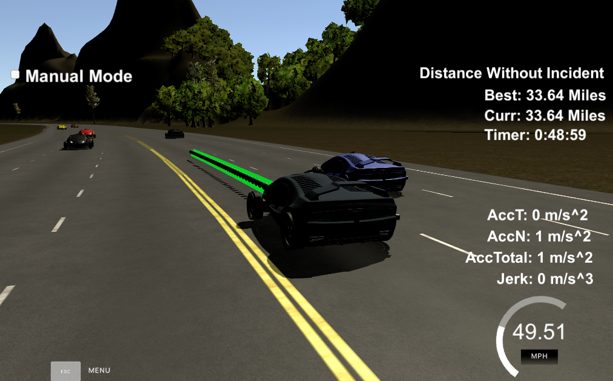

# CarND-Path-Planning-Project-P1
Udacity Self-Driving Car Nanodegree - Path Planning Project

# Overview

this project is path planning project.
In this project, we need to implement a path planning algorithms to drive a car on a highway on a simulator provided by Udacity([the simulator could be downloaded here](https://github.com/udacity/self-driving-car-sim/releases/tag/T3_v1.2)). The simulator sends car telemetry information (car's position and velocity) and sensor fusion information about the rest of the cars in the highway (Ex. car id, velocity, position). It expects a set of points spaced in time at 0.02 seconds representing the car's trajectory. The communication between the simulator and the path planner is done using [WebSocket](https://en.wikipedia.org/wiki/WebSocket). The path planner uses the [uWebSockets](https://github.com/uNetworking/uWebSockets) WebSocket implementation to handle this communication. Udacity provides a seed project to start from on this project ([here](https://github.com/udacity/CarND-Path-Planning-Project)).

# Prerequisites

The project has the following dependencies (from Udacity's seed project):

- cmake >= 3.5
- make >= 4.1
- gcc/g++ >= 5.4
- libuv 1.12.0
- Udacity's simulator.

# Deatils

- The car can drive fat least 4.32 miles without incident, following speed limit, and maximum acceleration and jerk are not exceed;
- in simulator, car have no crash accident;
- the car will perfer still in the middle lane of road (which lane=1;), and i set the code which during changing lane, it will based on costs of left change and right change, this code will chose the lowest cost of left/right lane change. if the cost is equal, it perfer left change, because left change is the similar with real road rules;
- in order make lane smooth, i use spline.h to smooth the anchor point, which is just the same in class;
- the path gengeration is following the class, 
  first bush_back some previsou way points, it will smooth and good for latency;
  based on current main car position, calculate 30, 60, 90 more distance s and d value, then change to global coordiante by using GetXY() function;
  calcualte spline line by using s.setpoints(x, y);
  calculate N(how many way points) based on velocity and dt=0.02, feed each points into spline and get pstx and psty;
  feed (pstx, psty) into next way points.
  
## Reflection

- vhiecle perform not very good during front, left and right side have veihcle, it will decrease and incresea speed, this will cause passenger uncomfortable;
- the algorithm only consider the adjacent lane, which means car will not change two lanes to get a better speed.
